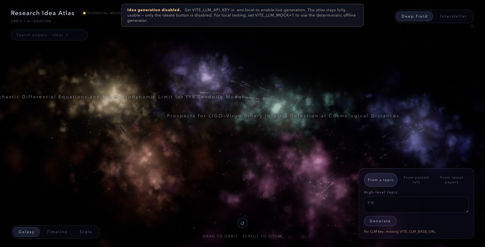

# Research Idea Atlas

An interactive **star map of research ideas**. Every node is either a real
arXiv paper or an AI-generated idea grounded in those papers; the two node
classes are visually distinct (paper-stars are white-hot with diffraction
spikes, idea-stars are orbital rings whose radius, dash density, hue, and
pulse encode the novelty methodology below). Click a star to read it; use the
Ideate panel (bottom-right) to generate new ideas from any combination of
topic text, arXiv ids, or the bundled seed corpus.



## Three generation entry points

1. **From a topic** — type a free-form research direction, e.g.
   *interpretable surrogate models for gravitational waveforms*.
2. **From pasted refs** — paste arXiv ids (`1908.08959`) or paper titles.
3. **From latest papers** — one click to ground an idea in the bundled seed
   corpus (25 real arXiv papers, listed in `src/data/seed-papers.json`).

All three are routed through `src/lib/ideate.js` → `src/lib/llm.js`. Exactly
**one** module talks to the LLM; missing keys → typed `MissingApiKeyError`,
banner shown, atlas keeps working.

## Novelty score

Every idea carries a 0–100 novelty score with a distinctive on-star treatment:
- **Ring radius** shrinks as novelty rises (small ring = far from prior art).
- **Dash density** scales with the evidence count.
- **Ring hue** encodes the opportunity pattern (bridge / gap / limit / reframing).
- **Pulse rate** encodes the research paradigm (synthesis / extension /
  novel-mechanism / new-domain).
- **Inner-dot brightness** rises with novelty.

The formula is grounded in two real arXiv papers:

| arXiv id | What we borrow |
|---|---|
| **[2607.04439](https://arxiv.org/abs/2607.04439)** — *ResearchStudio-Idea* (Zhao et al., 2026) | 15 ideation patterns, evidence-readiness gate, Scoop-Check collision logic. |
| **[2607.01233](https://arxiv.org/abs/2607.01233)** — *Measuring the Gap Between Human and LLM Research Ideas* (Chen, Zhao, Cohan, 2026) | 2-axis taste taxonomy (opportunity × paradigm). LLMs over-cluster on bridge / synthesis; we down-weight those. |

Full methodology: [docs/METHODOLOGY.md](docs/METHODOLOGY.md).

## Quick start

```bash
# 1. Install — auto-fetches ~25 arXiv seed papers (rate-limited, ~80s)
npm install

# 2. Optional — set an LLM key for live generation (any OpenAI-compatible endpoint)
cp .env.local.example .env.local
# edit .env.local: VITE_LLM_API_KEY=...

# 3. Dev server
npm run dev
# → http://localhost:5173

# 4. Build
npm run build

# 5. Validate the data files
npm run validate
```

If you skip step 2, the Ideate button is disabled and a banner explains why.
You can also set `VITE_LLM_MOCK=1` in `.env.local` to use the bundled
deterministic canned generator (useful for testing the full pipeline without a
key).

## Use cases

- **Research latest papers** → click *From latest papers* → get an idea
  grounded in the bundled corpus.
- **High-level research topic** → switch to *From a topic* → type → get an
  idea grounded in whatever papers the LLM service can supply via the seed set.
- **One or more papers / references** → switch to *From pasted refs* → paste
  arXiv ids or titles → get an idea grounded exactly in those.

## Architecture (one paragraph)

Client-side vanilla Three.js. arXiv is fetched via the public
`export.arxiv.org/api/query` (no key); LLM access is a single module
(`src/lib/llm.js`) reading `VITE_LLM_*` env vars. Ideas are spliced into a
pre-allocated GPU buffer (MAX_STARS=4096, MAX_EDGES=8192) — no scene rebuild.
Paper-paper lineage edges use the same shader path as paper-idea grounding
edges; the only difference is the `type` field (`derivation` / `inspiration` /
`grounding`) which routes to three different shader variants.

The previous physics-history content (simulations, tours, dust, demo stage) is
intentionally removed; the deepfield visual language and the three-lens
system (Galaxy / Timeline / Scale) are kept.

## Project structure

```
src/
  lib/            ONE LLM module · arXiv wrapper · novelty scorer · ideation orchestrator
  scene/          renderer · paper-stars · idea-stars · lineage · labels · camera · lens axes
  interact/       hover/click cross-layer highlight
  ui/             paper-card · idea-card · novelty gauge · ideate panel · api-key banner · search
  data/           stars.json · edges.json · seed-papers.json · ideation-patterns.json · branches
  utils/          deterministic PRNG, pixel-ratio helper
scripts/          fetch-seed-papers.mjs (postinstall)
tools/            validate.mjs (checks stars, edges, seed-papers)
docs/             PLAN.md · METHODOLOGY.md · EVAL_PLAN.md · screenshot-*.png
```

## Sources & limitations

- **arXiv** — hard requirement, used for seed corpus + live paper ingestion.
- **Hugging Face Daily Papers** — best-effort corpus fetch, failures swallowed.
- **Papers with Code** — best-effort enrichment (`codeUrl`, `tasks`), failures swallowed.
- **X / Twitter** — **dormant stub** at `src/lib/sources/x.js`. Activation
  requires a paid API tier; not shipped by default.
